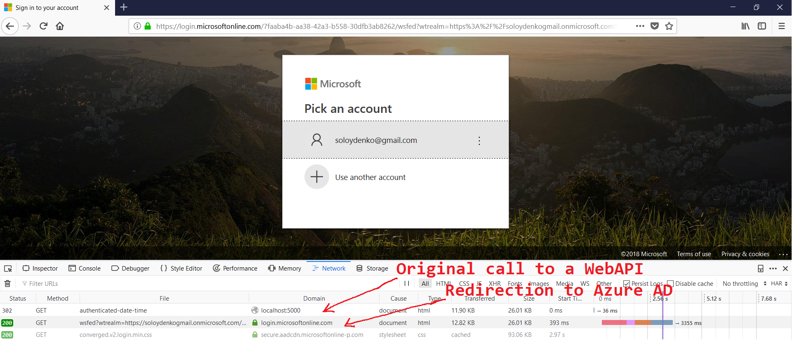
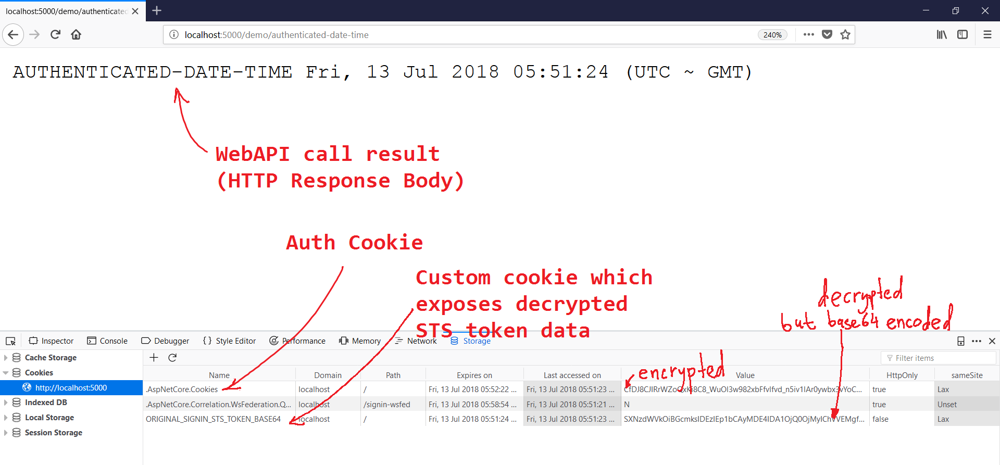
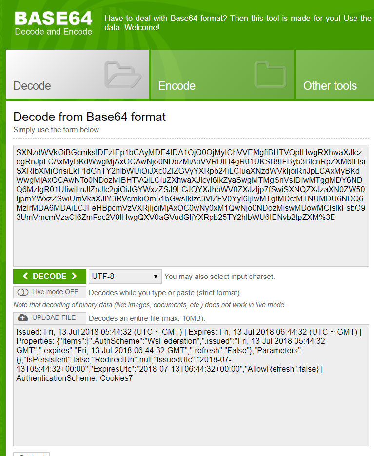

# demo-azure-active-directory-wsfederation

## `WebApp-WSFederation-DotNet.sln`

Part of this repository, namely `WebApp-WSFederation-DotNet.sln` solution, originates from Microsoft Documentation maintainers ([see original REAME](https://github.com/hris-front-end-team/demo-azure-active-directory-wsfederation/blob/master/ORIGINAL_MICROSOFT_README.md)).

This project was used as a playground to determine the basic configuration necessary to enable WsFederation (via Azure ADFS).
Things like `Wtrealm`, `MetadataAddress`, etc.

## `ApiWithAdfsAuth.sln`

`ApiWithAdfsAuth` solution implements a POC that illustrates several **.NET Core WebApi** authentication variants that are based on both:

* **Cookies** (`Microsoft.AspNetCore.Authentication.Cookies` namespace & [NuGet](https://www.nuget.org/packages/Microsoft.AspNetCore.Authentication.Cookies/)); and
* **WsFederation** (`Microsoft.AspNetCore.Authentication.WsFederation` namespace & [NuGet](https://www.nuget.org/packages/Microsoft.AspNetCore.Authentication.WsFederation/)).

### Prerequisites

#### Knowledge

The following resources are strongly recommended for looking at if you're new to the subject:

* [MSDN: Understanding WS-Federation (overview)](https://msdn.microsoft.com/en-us/library/bb498017.aspx?f=255&MSPPError=-2147217396)
* [MDN: HTTP cookies (overview)](https://developer.mozilla.org/en-US/docs/Web/HTTP/Cookies)
* [.NET Core Docs: Authenticate users with WS-Federation in ASP.NET Core](https://docs.microsoft.com/en-us/aspnet/core/security/authentication/ws-federation?view=aspnetcore-2.1)
* [.NET Core Docs: Use cookie authentication without ASP.NET Core Identity](https://docs.microsoft.com/en-us/aspnet/core/security/authentication/cookie?view=aspnetcore-2.1&tabs=aspnetcore2x)
* [StackOverflow: WsFederation & token sliding expiration](https://stackoverflow.com/a/28631956/482868)

#### Version

The solution is tested against .NET Core 2.1 (SDK/CLI) from MS Visual Studio Community Edition 2017 (`v15.3.4`).

```sh
$ dotnet --version
2.1.302
```

| NuGet Package                                    | Version |
| ------------------------------------------------ | ------- |
| Microsoft.AspNet.WebApi.Core                     | 5.2.6   |
| Microsoft.AspNetCore                             | 2.1.2   |
| Microsoft.AspNetCore.Authentication.Cookies      | 2.1.1   |
| Microsoft.AspNetCore.Authentication.WsFederation | 2.1.1   |
| Microsoft.AspNetCore.Mvc                         | 2.1.1   |
| Microsoft.Extensions.DependencyInjection         | 2.1.1   |

### Overview

#### High-level description of WebAPI relation to authentication/authorization

When a Web Service's API is invoked (from a web browser context) the following logic triggers:

```txt
(I) Web browser makes an HTTP Request (often via XHR object) as configured in client code (HTTP Verb + URL +
    optional body). Domain/path related cookies (including Auth cookie) are included into the request's headers.

(II) Web Service receives the request and based on the requested resource's confifguration determines whether
     authentication/authorization* is necessary.

  (III) If auth is NOT needed, the service's API code gets executed and the result is returned in an
        HTTP Response.

  (IV) If auth IS needed, the service will inspect the request for authentication cookie† presence.

    (V) If authentication cookie IS found, it's checked for expiration.

      (VI) If authentication cookie has NOT expired‡, it the authorization logic kicks in (e.g. user's
           identity/role/claims are checked against requested resource access configuration).

        (VII) If authorization rules ARE met, the service's API code gets executed and the result is returned
              in an HTTP Response.

        (VII) If authorization rules are NOT met, by default, HTTP 403 Forbidden Response is sent back,
              but things may vary -- alternatives will not be described here in detail.

      (IX) If authentication cookie is NOT found or HAS expired, by default, the authentication flow triggers,
           after which a redirection to the requested resource will happen (now with the unexpired authentication
           cookie), and the flow continues with step (II).
```

Authentication flow looks like this:

```txt
(X) Redirection to an Identity Provider/STS Service (e.g. ADFS).
(XI) The user logs in.
(XII) Redirection to a special web services URL§.
(XIII) The STS token is parsed, an authentication cookie is created.
(XIV) Redirect to pre-auth flow resource.
```

#### Implementation via .NET Core

##### Notes

\* (`II`) Authentication/authorization can be controlled by `[Microsoft.AspNetCore.Authorization.Authorize()]` attribute.

† (`IV`) By default, the authentication cookie's name is `.AspNetCore.Cookies`. It is is possible to configure a different name (`cookieOptions.Cookie.Name`).

‡ (`VI`) If _sliding expiration_ is configured, there's an extra bit of logic. A new cookie with a new expiration time is re-issued if a request happened at moment which is more than halfway through the expiration window.

§ (`XII`) By default, the ADFS redirects to `/signin-wsfed` location of the web service. This location is configurable (a setting in ADFS **AND** a matching value in `wsFederationOptions.CallbackPath`). The location is handled by `WsFederation`'s middleware automatically.

### Running the project

1. Navigate to `ApiWithAdfsAuth` directory.

    ```sh
    cd active-directory-dotnet-webapp-wsfederation/ApiWithAdfsAuth
    ```

1. A standard `dotnet restore` may or may not be necessary.

1. Start the service. Don't forget to specify the variant parameter.

    ```sh
    dotnet run --VariantNameKey=Variant1
    ```

1. Start a web browser and open its developer tools.

1. Navigate to `http://localhost:5000/demo/authenticated-date-time`.

1. Sign in when prompted.

1. Observe the response from the WebAPI. It should say the GMT/UTC time in the response body.

1. Inspect the cookies set for `localhost`.

When switching between the demo variants, it's recommended to close browser and manually delete the remaining `localhost` cookies to ensure a "clean" run.

### Variant 1 – Fixed short cookie expiration time

* Sets the **Cookie's** (not the STS token's!) expiration time to one minute on successful sign in.
* No sliding expiration is configured.
* Notice that cookie expiration is set from `SigningIn(CookieSigningInContext context)` and not elsewhere by assigning a value to `context.CookieOptions.Expires`.

Observe behavior: After one minute of successful sign in the cookie will expire and the next API call will result in another redirection to Identity Provider.

### Variant 2 – Fixed STS-token matching cookie expiration time

* Sets the **Cookie's** expiration time to exactly match the STS token's expiration time.
* No sliding expiration is configured.

Observe behavior: Similar to variant 1, but with a different (STS token-driven) time span matching.

### Variant 3 – Sliding expiration time via session cookie

* Sets the sliding expiration.
* The STS Token's expiration time is essentially overriden by Cookie auth middleware.
* The Auth cookie's expiration time is browser session long (cookie lives until browser gets closed).
* The expiration window slides whenever a request to an Authorized API is made _after_ less than half of the expiration window is remaining.

Observe behavior: the session is maintained after a successful sign in for as long as the requests to authorized WebAPI are frequent enough.

**IMPORTANT**: Make sure your browser does not have the "Restore tabs" feature enabled as it will interfere during the testing.

### What to inspect

#### Redirection to Azure Active Directory SignIn page



#### WebAPI results & Created cookies



#### Decoding base64 strings

To restore the base64 value of an encrypted STS token, use a tool of your choice.
There are plenty of online tools such as [base64decode.org](https://www.base64decode.org).
Just copy-paste the value and click "Decode".


